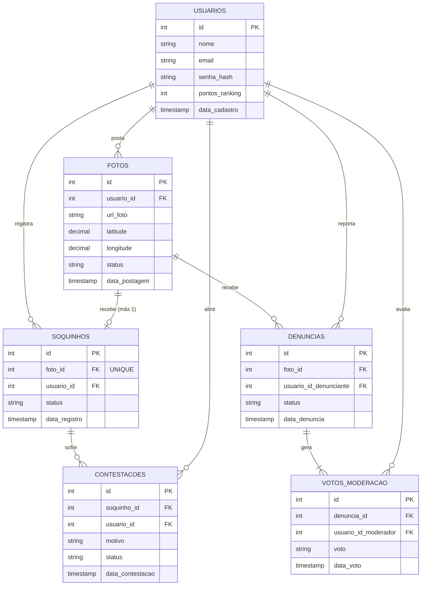
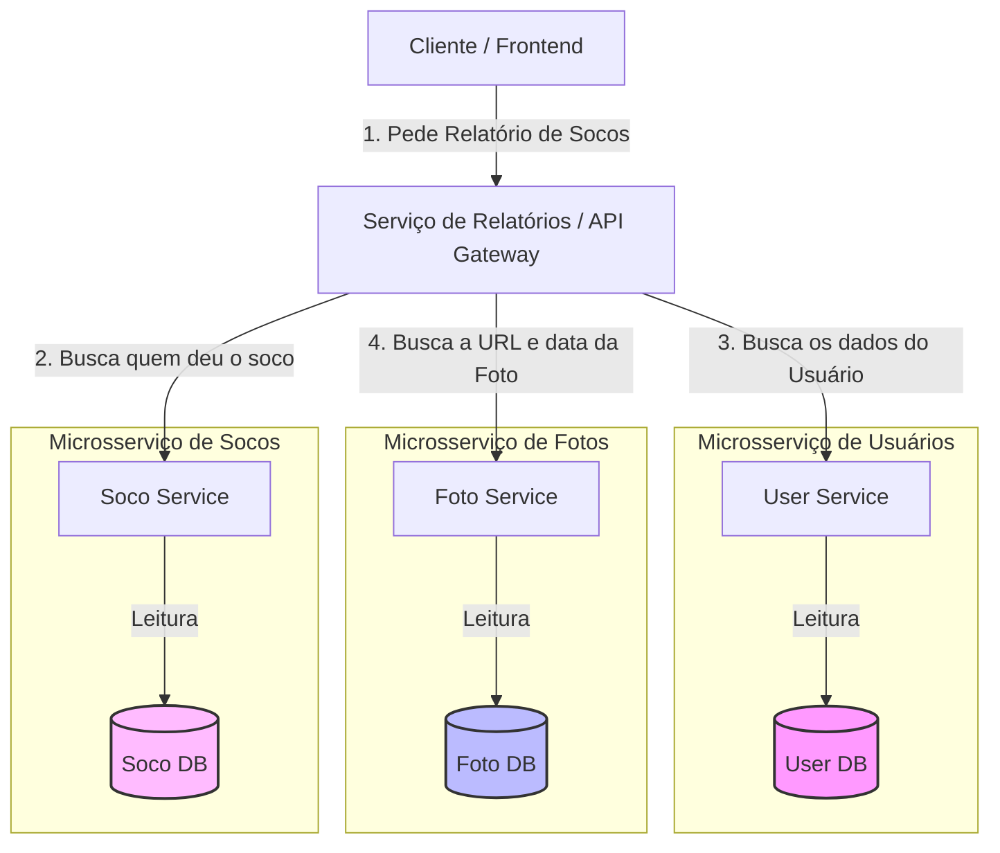

# Diagrama de Entidade Relacionamento (DER)

Abaixo está o modelo de dados para o monolito do Fusca Azul.



Agora temos uma visão de microsserviços



Como fica com um banco de relatórios

```mermaid
graph LR
    subgraph Microsserviços de Escrita
        A[User Service] -->|Evento: UsuarioCadastrado| MQ[RabbitMQ]
        B[Foto Service] -->|Evento: FotoPostada| MQ
        C[Soco Service] -->|Evento: SocoRegistrado| MQ
    end

    MQ -->|Consome Eventos| R_Svc[Serviço de Relatórios]
    R_Svc -->|Salva / Atualiza| R_DB[(Banco de Relatórios)]

    subgraph Estrutura do Banco de Relatórios
        R_DB --> T1[tabela_relatorio_socos]
    end