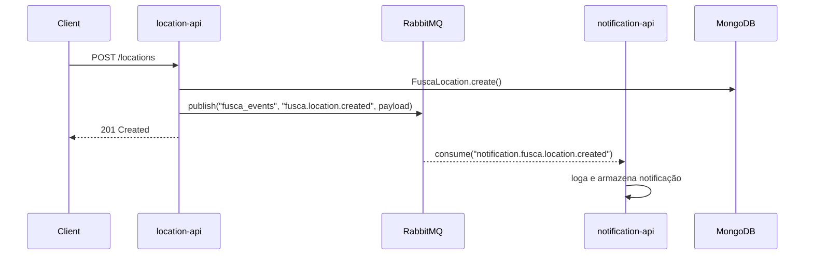

# RabbitMQ entre Microserviços — Exemplo

## Fluxo



## Conceitos utilizados

| Conceito | Valor |
|---|---|
| Exchange | `fusca_events` (tipo `topic`, durável) |
| Routing Key | `fusca.location.created` |
| Fila | `notification.fusca.location.created` (durável) |
| Prefetch | 1 (processa uma mensagem por vez) |
| Ack | manual — confirmado após processar com sucesso |
| Nack | sem requeue — descarta mensagem inválida |

## Como testar

### 1. Subir o ambiente

```bash
docker compose up --build
```

### 2. Criar uma localização (dispara o evento)

```bash
curl -X POST http://localhost:8000/location-api/locations \
  -H "Content-Type: application/json" \
  -d '{
    "geolocation": {
      "type": "Point",
      "coordinates": [-48.548, -27.596]
    },
    "locatedBy": "joao"
  }'
```

### 3. Ver notificações recebidas pelo consumer

```bash
curl http://localhost:3004/notifications
```

### 4. Painel de administração do RabbitMQ

Acesse **http://localhost:15672** com as credenciais `fusca` / `fusca123`.

Lá é possível visualizar:
- Exchange `fusca_events` e seus bindings
- Fila `notification.fusca.location.created` com mensagens entregues/pendentes
- Throughput em tempo real

### 5. Como inspecionar a mensagem no RabbitMQ

No painel web do RabbitMQ:

1. Entre em **Queues and Streams**.
2. Abra a fila `notification.fusca.location.created`.
3. Na seção **Get messages**, use:
   - Ack mode: `Requeue true`
   - Encoding: `auto`
   - Messages: `1`
4. Clique em **Get Message(s)**.

Se a fila estiver vazia, isso normalmente significa que a `notification-api` já consumiu e confirmou a mensagem. Para enxergar a mensagem antes do consumo:

```bash
docker compose stop notification-api
```

Depois publique um novo evento:

```bash
curl -X POST http://localhost:8000/location-api/locations \
  -H "Content-Type: application/json" \
  -d '{
    "geolocation": {
      "type": "Point",
      "coordinates": [-48.548, -27.596]
    },
    "locatedBy": "joao"
  }'
```

Volte ao painel e confira a fila com mensagens em estado **Ready**. Depois que terminar a inspeção, suba o consumer novamente:

```bash
docker compose start notification-api
```

### 6. Verificar logs do consumer

```bash
docker logs -f fusca-notification-api
```
