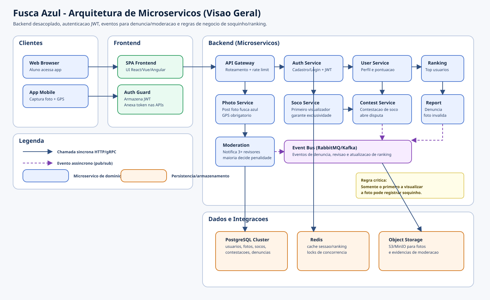

# Fusca Azul — Requisitos Básicos

## Contexto
O **Fusca Azul** é um aplicativo de estudo para aulas de microserviços, voltado a alunos de Ciência da Computação da oitava fase.

## Requisitos Funcionais
1. **Cadastro de usuários**
	- O sistema deve permitir o cadastro de novos usuários.

2. **Autenticação**
	- O sistema deve permitir login e controle de sessão de usuários autenticados.

3. **Postagem de foto com geolocalização**
	- O usuário deve poder postar foto de um fusca azul.
	- A postagem deve incluir geolocalização.

4. **Soquinho para o primeiro que visualizar**
	- Apenas a primeira pessoa que visualizar a foto pode registrar um soquinho.
	- Demais usuários não podem registrar soquinho para a mesma foto.

5. **Ranking de usuários**
	- O sistema deve manter ranking com usuários que possuem mais soquinhos.

6. **Contestação de soquinho**
	- O sistema deve permitir contestar soquinhos registrados.

7. **Denúncia de foto inválida**
	- O sistema deve permitir denúncia de foto quando não for de um fusca azul.

8. **Moderação por usuários com mais pontos**
	- Usuários com mais pontos podem receber denúncias para análise.
	- Ao menos 3 usuários devem ser notificados para avaliar a denúncia.
	- A redução de pontos só ocorre quando houver maioria de votos aceitando a denúncia.

## Requisitos Não Funcionais
1. **Arquitetura de microserviços**
	- O sistema deve ser estruturado em microserviços.

2. **Autenticação baseada em JWT**
	- O mecanismo de autenticação deve usar JWT.

3. **Separação entre backend e frontend**
	- Backend e frontend devem ser implementados de forma separada.

# Arquitetura do Fusca Azul

